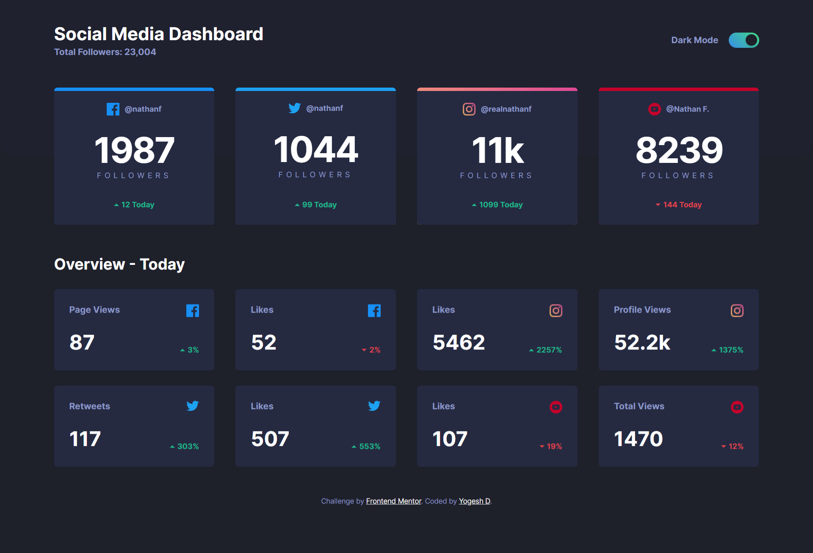
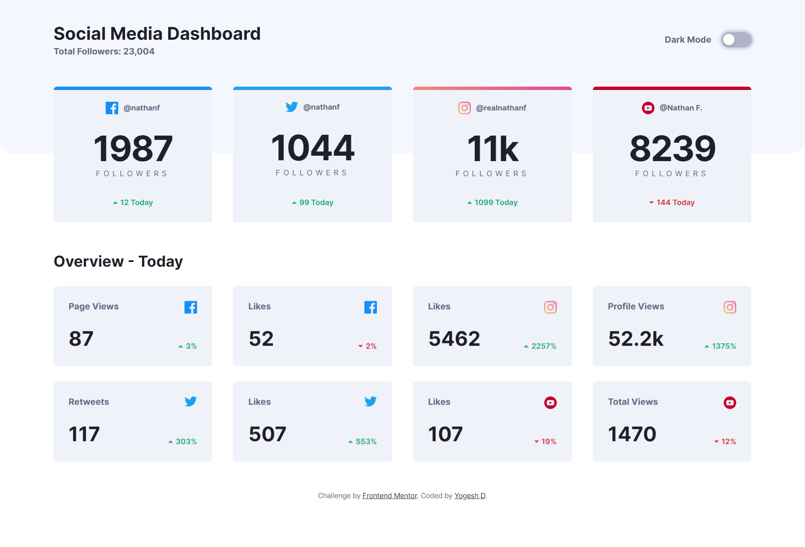
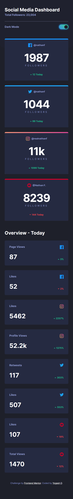
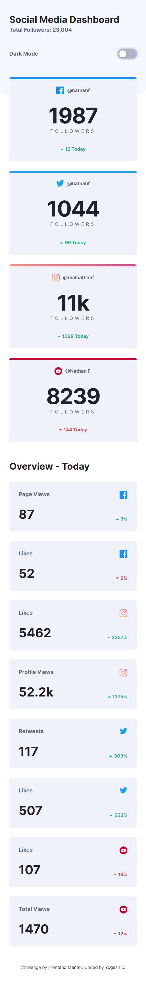

# Frontend Mentor - Social media dashboard with theme switcher solution

This is a solution to the [Social media dashboard with theme switcher challenge on Frontend Mentor](https://www.frontendmentor.io/challenges/social-media-dashboard-with-theme-switcher-6oY8ozp_H). Frontend Mentor challenges help you improve your coding skills by building realistic projects.

## Table of contents

- [Frontend Mentor - Social media dashboard with theme switcher solution](#frontend-mentor---social-media-dashboard-with-theme-switcher-solution)
  - [Table of contents](#table-of-contents)
  - [Overview](#overview)
    - [The challenge](#the-challenge)
    - [Screenshot](#screenshot)
    - [Links](#links)
  - [My process](#my-process)
    - [Built with](#built-with)
    - [What I learned](#what-i-learned)
    - [Continued development](#continued-development)
    - [Useful resources](#useful-resources)
  - [Author](#author)
  - [Getting Started with Create React App](#getting-started-with-create-react-app)
    - [Available Scripts](#available-scripts)
      - [`yarn start`](#yarn-start)
      - [`yarn test`](#yarn-test)
      - [`yarn build`](#yarn-build)
      - [`yarn eject`](#yarn-eject)
    - [Learn More](#learn-more)

**Note: Delete this note and update the table of contents based on what sections you keep.**

## Overview

### The challenge

Users should be able to:

- View the optimal layout for the site depending on their device's screen size
- See hover states for all interactive elements on the page
- Toggle color theme to their preference

### Screenshot









### Links

- [Solution](https://github.com/yogeshdatir/social-media-dashboard-with-theme-switcher)
- [Live Site](https://dashboard-with-theme.netlify.app/)

## My process

### Built with

- Flexbox
- Mobile-first workflow
- [React](https://reactjs.org/) - JS library
- [TypeScript](https://www.typescriptlang.org/) - for type checking
- [Emotion](https://emotion.sh/) - for writing css styles with JavaScript

### What I learned

Used this project to practice layout, theming with emotion, React and typescript. Also, used this opportunity to create a **toggle switch** with a modern design.

My Learnings from this project are:

1. How to create a theming system with emotion and typescript
2. How to create a toggle switch in react
3. Types for theming
4. Borders which include linear gradient colors and border-radius

```tsx
export const MainCardContainer = styled(ResponsiveGrid)`
  height: 13.5rem;
  background: ${({ theme }) => theme.background.card};
  border-radius: 5px;
  padding: 1.5rem;
  box-sizing: border-box;
  display: flex;
  flex-direction: column;
  align-items: center;
  justify-content: space-between;
  position: relative;

  /* https://dev.to/afif/border-with-gradient-and-radius-387f - Border with gradient and border-radius */
  // since border-color property doesn't accept gradients, a mask is added to display it as a border.

  ::before {
    content: "";
    position: absolute;
    inset: 0;
    border-radius: 5px;
    padding: 0;
    padding-top: 5px;
    background: ${({
      borderColor: { gradient, color },
    }: IMainCardContainerProps) => (gradient ? gradient : color)};
    -webkit-mask: linear-gradient(#fff 0 0) content-box, linear-gradient(
        #fff 0 0
      );
    -webkit-mask-composite: xor;
    mask-composite: exclude;
  }
`;
```

[This is the resource](https://dev.to/afif/border-with-gradient-and-radius-387f) for this problem resolution which talks about the gradient borders with radius in details.

### Continued development

I will be consistently working on ways to make code with emotion and Typescript better.

### Useful resources

- [Theming with emotion](https://emotion.sh/docs/theming#themeprovider-reactcomponenttype) - This helped me for to create theming.
- [This video tutorial](https://www.youtube.com/watch?v=1W3mAtAT7os) helped me to learn about toggle switch with modern design.

## Author

- [My Github](https://github.com/yogeshdatir)
- Frontend Mentor - [@YogeshD](https://www.frontendmentor.io/profile/yogeshdatir)

---

This project was bootstrapped with
[Create React App](https://github.com/facebook/create-react-app).

## Getting Started with Create React App

This project was bootstrapped with [Create React App](https://github.com/facebook/create-react-app).

### Available Scripts

In the project directory, you can run:

#### `yarn start`

Runs the app in the development mode.\
Open [http://localhost:3000](http://localhost:3000) to view it in the browser.

The page will reload if you make edits.\
You will also see any lint errors in the console.

#### `yarn test`

Launches the test runner in the interactive watch mode.\
See the section about [running tests](https://facebook.github.io/create-react-app/docs/running-tests) for more information.

#### `yarn build`

Builds the app for production to the `build` folder.\
It correctly bundles React in production mode and optimizes the build for the best performance.

The build is minified and the filenames include the hashes.\
Your app is ready to be deployed!

See the section about [deployment](https://facebook.github.io/create-react-app/docs/deployment) for more information.

#### `yarn eject`

**Note: this is a one-way operation. Once you `eject`, you can’t go back!**

If you aren’t satisfied with the build tool and configuration choices, you can `eject` at any time. This command will remove the single build dependency from your project.

Instead, it will copy all the configuration files and the transitive dependencies (webpack, Babel, ESLint, etc) right into your project so you have full control over them. All of the commands except `eject` will still work, but they will point to the copied scripts so you can tweak them. At this point you’re on your own.

You don’t have to ever use `eject`. The curated feature set is suitable for small and middle deployments, and you shouldn’t feel obligated to use this feature. However we understand that this tool wouldn’t be useful if you couldn’t customize it when you are ready for it.

### Learn More

You can learn more in the [Create React App documentation](https://facebook.github.io/create-react-app/docs/getting-started).

To learn React, check out the [React documentation](https://reactjs.org/).
